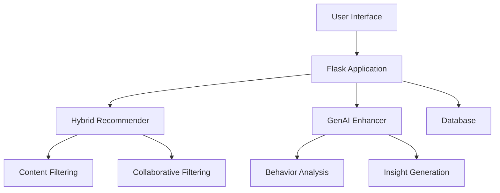
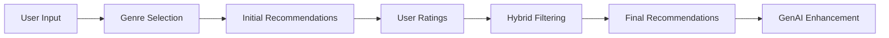
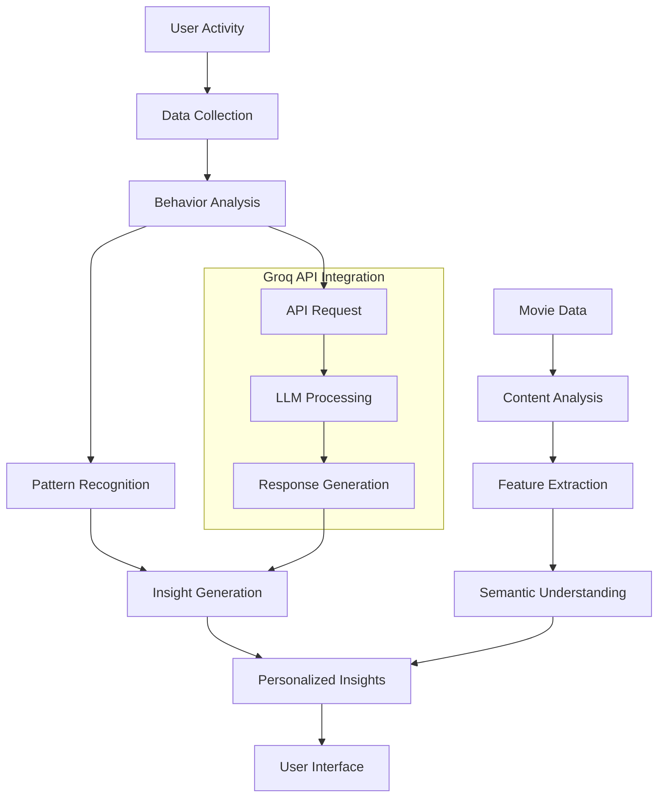
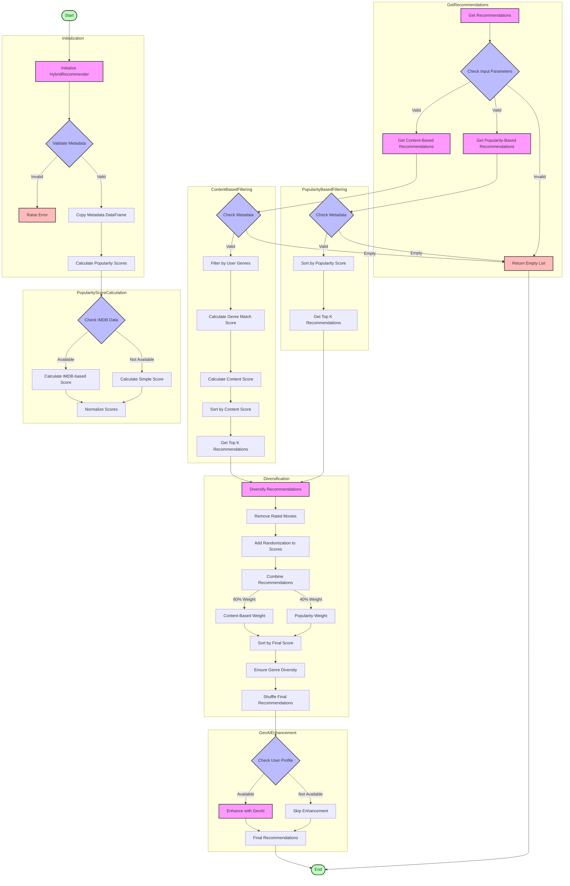

# AI-Powered Movie Recommendation System

A full-stack, AI-powered movie recommender web application built with Flask, SQLAlchemy, and modern hybrid recommendation techniques. The system combines collaborative filtering, content-based filtering, and GenAI to provide personalized movie recommendations and insights.

## 🌟 Features

- **Hybrid Recommendation Engine**
  - Content-based filtering using movie metadata
  - Collaborative filtering using user ratings
  - Similar user analysis for better personalization

- **GenAI Integration**
  - Behavior analysis and insights
  - Personalized movie descriptions
  - User preference analysis

- **User Features**
  - Secure authentication system
  - Genre preference selection
  - Movie rating and watch history
  - Personalized recommendations
  - Activity tracking and insights

## 📊 Architecture

### System Overview


### Recommendation Flow


### GenAI Integration Flow


### Project flow


## 🔄 Technical Stack

- **Backend**: Python, Flask
- **Database**: SQLite with SQLAlchemy
- **AI/ML**: 
  - Hybrid recommender system
  - Groq API for GenAI features
- **Frontend**: HTML, CSS, JavaScript
- **Data Processing**: Pandas, NumPy

## 📥 Installation

1. Clone the repository:
```bash
git clone https://github.com/prathameshmohod174/genai_movie_recommendation_system.git
cd genai_movie_recommendation_system
```

2. Install dependencies:
```bash
pip install -r requirements.txt
```

3. Set up environment variables:
Create a `.env` file in the project root and add:
```
GROQ_API_KEY=YOUR_GROQ_API_KEY
```

4. Download required data files:
Download the zip from the link - [Dataset](https://grouplens.org/datasets/movielens/32m/)
- Extract the the zip.
- Copy the three files 
   - movies.csv
   - movie_metadata.csv
   - ratings.csv
   to the project directory.


Place these files in the project root directory.

## 🚀 Running the Application

1. Initialize the database:
```bash
python database.py
```

2. Start the Flask server:
```bash
python app.py
```

3. Access the application at: http://localhost:5000


## 🔄 Project Flow

1. **User Onboarding**
   - Sign up/login
   - Select preferred genres
   - Initial preference analysis

2. **Recommendation Process**
   - Hybrid filtering combines multiple approaches
   - Real-time preference updates
   - Continuous learning from user behavior

3. **GenAI Enhancement**
   - Behavior pattern analysis
   - Personalized insights
   - Dynamic content adaptation

## 📝 API Documentation

### Groq API Integration
The system uses Groq API for GenAI features. Replace `YOUR_GROQ_API_KEY` in the `.env`, `config.json` and `genai_enhancer.py` file with your actual API key.

### Endpoints
- `/signup` - User registration
- `/login` - User authentication
- `/select_genres` - Genre preference selection
- `/rate_movies` - Movie rating interface
- `/watch_movies` - Watch history tracking
- `/recommendations` - Get personalized recommendations
- `/activity` - View user activity and insights

## 🤝 Contributing

1. Fork the repository
2. Create your feature branch (`git checkout -b feature/AmazingFeature`)
3. Commit your changes (`git commit -m 'Add some AmazingFeature'`)
4. Push to the branch (`git push origin feature/AmazingFeature`)
5. Open a Pull Request

## 📄 License

This project is licensed under the Personal Use License - see the [LICENSE](LICENSE) file for details.
This license allows personal, non-commercial use only. Commercial use is strictly prohibited.

## 👥 Authors

- **Prathamesh Mohod** - *Initial work* - [GitHub Profile](https://github.com/prathameshmohod174)

## 🙏 Acknowledgments

- MovieLens dataset for training data
- Groq API for GenAI capabilities
- Flask and SQLAlchemy communities 